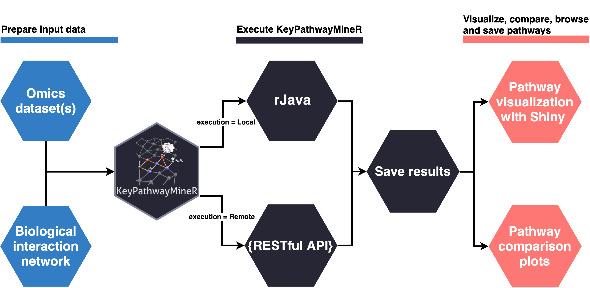

KeyPathwayMineR - R package 
============ 
 

Given a **biological network** and a **set of case-control studies**, KeyPathwayMiner(KPM) efficiently extracts all             **maximal connected sub-networks**. These sub-networks contain the genes that are **mainly** dysregulated, e.g.,           differentially expressed, in **most** cases studied:

* The exact quantities for “mainly” and “most” are modeled with two easy-to-interpret parameters **(K, L)** that allows      the user to control the number of outliers (not dysregulated genes/cases) in the solutions.
     
Two different approaches for extracting subnetworks that are enriched for active/deregulated genes have been               implemented:

  * **INES:**  Extract all maximal sub-networks containing nodes with no more than L inactive cases besides of K exceptions.
      
  * **GLONE:** Extracts maximal sub-networks where the total sum of **not**-active/diff. exp. cases is at most L. 
      
For more information please visit our website [(Key Pathway Miner website)](https://keypathwayminer.compbio.sdu.dk/keypathwayminer/).

Overview
=================
<!--ts-->
   * [Purpose](#purpose)
   * [Prerequisites](#prerequisites)
   * [Get started](#get-started)
      * [Users](#users)
      * [Developers](#developers)
* [Typical workflow](#typical-workflow)

* [Common problems](#common-problems)
<!--te-->

Purpose
=================
The following package provides an easy way for using KPM and visualize the extracted subnetworks via R. The user can decide whether he wants to call KPM on his computer (via standalone) or with the Web API. With the kpm_options() object the arguments for the execution of the program can be easily processed and viewed.

Prerequisites
=================
KeyPathwayMineR uses the [rJava](https://github.com/s-u/rJava) library to run the local (Java - standalone) version of KPM. 
This package allows us to utilize the different functions from the standalone jar needed to run KeyPathwayMiner. To use this functionality, you should run Java 1.8 or higher on your machine.
 
Get started
=================
Once your R client has been successfully configured you can start using the package.

Users
-----
KeyPathwayMiner is currently available on github and can be installed through the devtools R package:
      
      # Install KeyPathwayMineR from github and build vignettes
      if (!requireNamespace("devtools", quietly = TRUE)) install.packages("devtools")
      devtools::install_github("baumbachlab/keypathwayminer-R", build_vignettes = TRUE)
          
      # Load and attach KeyPathwayMineR 
      library("KeyPathwayMineR")

If the initialization was successful you will get following output:
      
      #> Loading required package: rJava
      #> Standalone jar added to class path:  TRUE
      #> Utils: The Java virtual machine is available and has the correct version.
      #> KeyPathwayMineR ready for local and remote execution.
      
When everything is set up you can get started with the following vignettes:

      vignette("KeyPathwayMineR")
      vignette("input_files_format")

Developers
-----
If you want to play around or work on the code you can clone the repo:

      git clone https://github.com/baumbachlab/keypathwayminer-R.git

Opent the *KeyPathwayMineR.Rproj* file to open the package. To get started install the following libraries:

      install.packages(c("devtools", "roxygen2", "testthat", "knitr"))

Typical workflow
============ 
 

 Common problems
=================
* If you have problems with R using the correct Java version, this guide may be helpful [here](https://github.com/Utah-Data-Science/Home_repo/wiki/Getting-R-to-use-the-correct-Java-version).

* Java is not installed. Browse the web for instructions specific for your operating system to install Java.

* rJava is not installed. Fix by install.packages("rJava")

* Java is not properly configured. Under linux this can often be fixed by sudo update-alternatives --config java. Another option is to set the environment variable JAVA_HOME correctly.

* rJava is not properly configured. This can often be fixed by sudo R CMD javareconf

* On windows when 32 bit and 64 bit version are installed: ERROR: loading failed for 'i386'. Try installing as follows: install_github("baumbachlab/keypathwayminer-R", INSTALL_opts=c("--no-multiarch")) 

* Vignette re-building failed. Install the package without building vignettes as follows: install_github("baumbachlab/keypathwayminer-R"). Download vignettes input_files_format.Rmd and KeyPathwayMiner.Rmd from the vignettes folder manually, open them on R-studio and knit (CTRL/CMD+Shift+K) them.

If any other problems occur consider creating an issue. [[CREATE ISSUE](https://github.com/baumbachlab/keypathwayminer-R/issues)]

